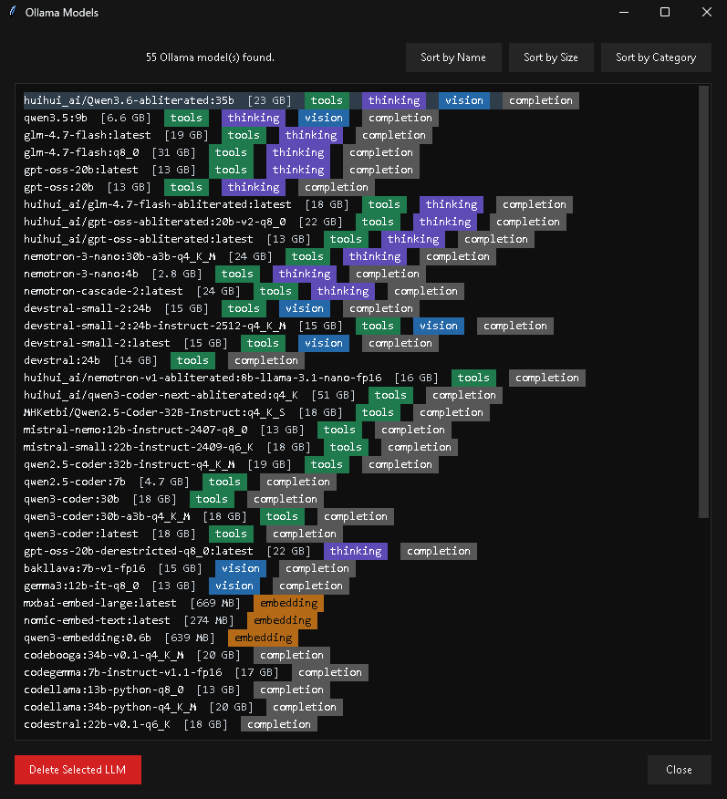

# Ollama LLMs Manager

Windows GUI tools for browsing, installing, and managing Ollama models.

---



---

## Overview

This repository contains two desktop applications and their Python source files:

- `Ollama_LLMs_Manager.exe` / `Ollama_LLMs_Manager.py`
  - Manage models that are already installed in your local Ollama instance.
  - View local models, inspect capability badges, sort them, and delete selected models.

- `Ollama_LLMs_Retriever.exe` / `Ollama_LLMs_Retriever.py`
  - Browse the Ollama online library from a Tk GUI.
  - View model categories, open tag lists, and install a selected `model:tag` into your local Ollama setup.

## Features

- Browse local Ollama models with category badges
- Browse remote models from `https://ollama.com/library`
- View model tags and install a selected tag from the GUI
- Category-aware sorting for model lists
- Dark Anthracite-themed Windows UI
- Automatic Ollama executable detection on Windows

## Supported Model Categories

- **Tools**
- **Thinking**
- **Vision**
- **Embedding**
- **Completion**
- **Audio**
- **Cloud**

## Releases

Download prebuilt executables from the [Releases](https://github.com/Gabrieliam42/Ollama_LLMs_Manager/releases) page:

- `Ollama_LLMs_Manager.exe`
- `Ollama_LLMs_Retriever.exe`

## Installation

### Option 1: Executables

1. Download `Ollama_LLMs_Manager.exe` and/or `Ollama_LLMs_Retriever.exe` from [Releases](https://github.com/Gabrieliam42/Ollama_LLMs_Manager/releases).
2. Install Ollama from [ollama.ai](https://ollama.ai) if it is not already installed.
3. Run the executable you want to use.

### Option 2: Python source

1. Ensure Python 3.12+ is installed.
2. Install Ollama from [ollama.ai](https://ollama.ai).
3. Clone the repository:

```bash
git clone https://github.com/Gabrieliam42/Ollama_LLMs_Manager.git
cd Ollama_LLMs_Manager
```

4. Install dependencies:

```bash
pip install -r requirements.txt
```

5. Run either application:

```bash
python Ollama_LLMs_Manager.py
python Ollama_LLMs_Retriever.py
```

## Requirements

- Windows 10/11
- Ollama
- Python 3.12+ when running from source

## Ollama Detection

Both applications search for `ollama.exe` in these locations:

1. `OLLAMA_EXE`
2. The application directory
3. An `Ollama` subdirectory next to the application
4. Windows `PATH`
5. `%LOCALAPPDATA%\Programs\Ollama`
6. `%ProgramFiles%\Ollama`
7. `%ProgramFiles(x86)%\Ollama`

To use a custom location:

```bash
set OLLAMA_EXE=C:\Path\To\Your\ollama.exe
```

## Files

- `Ollama_LLMs_Manager.py` - Python source for the local model manager
- `Ollama_LLMs_Manager.exe` - Prebuilt local model manager executable
- `Ollama_LLMs_Retriever.py` - Python source for the remote library browser / installer
- `Ollama_LLMs_Retriever.exe` - Prebuilt remote library browser / installer executable
- `requirements.txt` - Python dependencies

## Development

Install dependencies:

```bash
pip install -r requirements.txt
```

Run Ruff:

```bash
ruff check .
```

## Troubleshooting

### Could not locate `ollama.exe`

Make sure Ollama is installed and available through one of the detection paths listed above.

### Dark theme not applied

Restart the application and ensure you are running on Windows with normal desktop composition enabled.

## Author

**Gabriel Mihai Sandu**

- GitHub: [@Gabrieliam42](https://github.com/Gabrieliam42)

## License

This project is provided as-is.

## Support

For issues or feature requests, use the [GitHub repository](https://github.com/Gabrieliam42/Ollama_LLMs_Manager).

---

**Note**: Ollama itself must be installed separately from [ollama.ai](https://ollama.ai).

